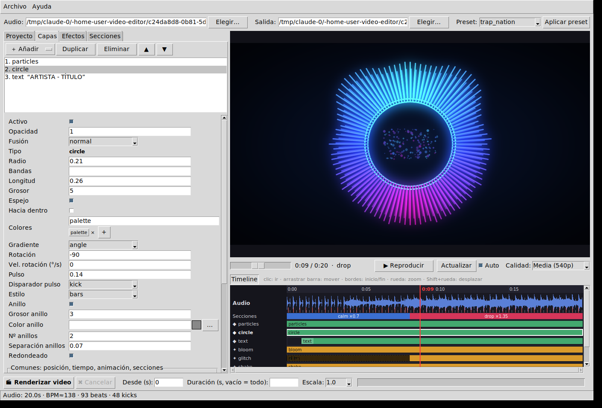

# musicviz — generador de videos *music visualizer* en Python

Crea videos tipo **Trap Nation / Monstercat / NCS** para tus canciones de dubstep, EDM,
drum & bass, etc.: espectros de audio (circulares, barras, forma de onda), partículas
que reaccionan al ritmo, glitch, bloom, shake, aberración cromática y más. Todo se
configura con un archivo YAML por proyecto, así que puedes personalizar cada detalle
o partir de los presets incluidos.

Pensado para correr en tu laptop (MSI Cyborg 15: i7‑12650H, RTX 4060, 8 GB RAM, Windows 11):
el render usa varios núcleos de CPU en paralelo y la codificación del video se hace con
**NVENC** (la GPU) a través de ffmpeg.

---

## 1. Instalación (Windows 11)

### Opción rápida (sin escribir comandos)

1. Descarga el proyecto como ZIP desde GitHub (**Code → Download ZIP**) y descomprímelo, por ejemplo en `C:\musicviz`.
2. Instala Python desde <https://www.python.org/downloads/> marcando **Add python.exe to PATH**.
3. Haz doble clic en **`instalar.bat`**: instala ffmpeg (con winget) si falta, crea el entorno y descarga las
   dependencias (~100 MB). Al final muestra `musicviz check`.
4. Abre la aplicación con doble clic en **`musicviz-gui.bat`**. `musicviz-consola.bat` abre una terminal con el
   entorno listo para usar los comandos.

### Opción manual

1. **Python 3.10 o superior** → <https://www.python.org/downloads/> (marca *Add Python to PATH*).
2. **ffmpeg** (incluye soporte NVENC):
   ```powershell
   winget install Gyan.FFmpeg
   ```
   Cierra y vuelve a abrir la terminal, y comprueba con `ffmpeg -version`.
3. **musicviz** (desde la carpeta del repositorio):
   ```powershell
   python -m venv .venv
   .\.venv\Scripts\activate
   pip install -e .
   pip install sounddevice   # opcional: audio en la vista previa
   ```
4. Verifica el entorno:
   ```powershell
   musicviz check
   ```
   Debe aparecer `h264_nvenc → funciona`. Si no, actualiza los drivers NVIDIA; mientras tanto
   se usará `libx264` (CPU) automáticamente.

> En Linux/macOS funciona igual (instala ffmpeg con tu gestor de paquetes).

### Verificar la instalación (cualquier versión de Python 3.10 a 3.14)

```powershell
pip install -e .[dev]
pytest
```

La suite comprueba el análisis de audio, todas las capas y efectos, la exportación real con ffmpeg
(incluida la cancelación) y una prueba de humo de la interfaz gráfica (abre la ventana, genera la vista
previa, renderiza un clip y lo cancela). El repositorio incluye integración continua en GitHub Actions
que ejecuta la misma suite en **Windows y Linux con Python 3.10, 3.12, 3.13 y 3.14**.

---

## 2. Interfaz gráfica

```powershell
musicviz gui                 # o: musicviz-gui, o: python -m musicviz.gui
musicviz gui mi_video.yaml   # abrir un proyecto existente
```



- **Arriba**: archivo de audio, video de salida y preset base (*Aplicar preset* reemplaza capas y efectos).
- **Proyecto**: resolución, FPS, códec, análisis de audio (bandas, suavizado, sensibilidad de beats) y fondo.
- **Capas / Efectos**: lista ordenable (añadir, duplicar, eliminar, subir/bajar) y un formulario con todas las
  opciones del elemento seleccionado; los campos inválidos se marcan en rojo y el motivo aparece en la barra de estado.
  Los campos de colores muestran una fila de muestras: clic en una muestra para cambiarla, **×** para quitarla,
  **+** para añadir con el selector de color y **⇄** para invertir el degradado.
- **Vista previa**: se actualiza sola al cambiar cualquier valor (casilla *Auto*), con control de tiempo,
  calidad y botón *Reproducir* (con audio si instalaste `sounddevice`).
- **Timeline** (panel plegable bajo la vista previa): forma de onda con beats y kicks, secciones coloreadas,
  y una fila por capa y por efecto con su ventana de tiempo, las animaciones de entrada/salida sombreadas y
  atenuados los tramos donde la sección no los permite. Clic en el audio para saltar, clic en una barra para
  seleccionar ese elemento, arrastrar sus bordes para cambiar inicio y fin, arrastrarla entera para moverla,
  arrastrar el límite entre dos secciones para ajustarlo, rueda para hacer zoom y Shift+rueda para desplazarse.
- **Renderizar video**: render completo o un fragmento (*Desde* / *Duración* / *Escala*) con barra de progreso;
  la ventana sigue usable mientras tanto y el botón *Cancelar* detiene el render y borra el archivo parcial.
- *Archivo → Guardar* escribe el YAML, que también puedes editar a mano o usar con la línea de comandos.
  *Archivo → Recientes* recuerda los últimos 10 proyectos abiertos o guardados.

## 3. Uso rápido (línea de comandos)

```powershell
# 1) Crear un proyecto a partir de un preset
musicviz init mi_video.yaml --audio "C:\Musica\mi_cancion.mp3" --preset trap_nation

# 2) Ver un frame para ajustar el diseño (rápido)
musicviz snapshot mi_video.yaml --time 45 --output prueba.png

# 3) Vista previa en ventana (ESC salir, ESPACIO pausa, ←/→ saltar 5 s)
musicviz preview mi_video.yaml --scale 0.5

# 4) Render de prueba de 10 s a media resolución
musicviz render mi_video.yaml --start 40 --duration 10 --scale 0.5 -o prueba.mp4

# 5) Render final (1080p60 con NVENC)
musicviz render mi_video.yaml
```

Otros comandos:

| Comando | Qué hace |
|---|---|
| `musicviz presets` | Lista los presets y su descripción |
| `musicviz analyze cancion.mp3` | Duración, BPM estimado, beats, kicks y "drop" más fuerte |
| `musicviz check` | Comprueba ffmpeg, NVENC, OpenCV, CPUs |
| `musicviz fonts [filtro]` | Lista las fuentes del sistema utilizables en `font:` |
| `musicviz sections cancion.mp3` | Detecta las secciones (calm / build / drop) y las imprime en YAML |
| `musicviz gui [proyecto.yaml]` | Abre la interfaz gráfica |
| `musicviz render ... --workers 6` | Número de procesos de render en paralelo |

---

## 4. Presets incluidos

| Preset | Estilo |
|---|---|
| `trap_nation` | Círculo central con barras radiales simétricas que pulsan con el bass, partículas en cada golpe, bloom y shake |
| `monstercat` | Barras blancas limpias, título grande, barra de progreso con tiempo. Minimalista |
| `ncs` | Anillo con espectro relleno de gradiente neón, rotación lenta, partículas flotando, cambio de tono |
| `dnb_glitch` | Barras simétricas con espejo, glitch/pixelado en los kicks, strobe y desenfoque radial en los drops |
| `minimal` | Plantilla mínima para empezar desde cero |
| `spectrum_only` | Sólo el espectro circular con fondo transparente (.mov con alfa) para superponer en otro editor |
| `auto_sections` | Secciones automáticas (calma / subida / drop) con paletas distintas, fondo que vibra con los kicks y glitch sólo en los drops |

`musicviz init` copia el preset (con comentarios) a tu YAML: edita, guarda y vuelve a
hacer `snapshot`/`render`. Mira `examples/proyecto_completo.yaml` para un ejemplo comentado
con todas las opciones.

---

## 5. Estructura del proyecto (YAML)

```yaml
name: mi_video
output:
  path: mi_video.mp4
  width: 1920
  height: 1080
  fps: 60
  codec: auto          # auto | h264_nvenc | hevc_nvenc | libx264 | libx265
  bitrate: 16M
  workers: 0           # 0 = automático
audio:
  file: cancion.mp3
  start: 0             # recorte opcional (segundos)
  duration: null
  bands: 64            # nº de bandas del espectro
  fmin: 30
  fmax: 16000
  smoothing: {attack: 0.7, release: 0.25}   # respuesta de las barras
  normalize: hybrid    # hybrid | per_band | global
  beat_sensitivity: 1.0
background: {...}
layers: [...]
effects: [...]
```

Las medidas en píxeles (grosores, radios de glow, cantidad de shake) se expresan "a 1080p"
y se escalan solas con la resolución. Posiciones y tamaños relativos van de 0 a 1.

### Disparadores (`trigger`)

Muchos parámetros (efectos, pulso del círculo, logo, texto, fondo) se controlan con un
disparador que toma un valor 0..1 por frame a partir del audio:

| trigger | Fuente |
|---|---|
| `always` | Siempre 1 |
| `beat` | Envolvente que salta en cada beat detectado y decae |
| `kick` | Igual pero sólo con golpes de graves (ideal para dubstep/dnb) |
| `bass` / `energy` / `treble` | Energía de graves / global / agudos por encima de `threshold` |
| `drop` | Secciones donde el volumen sube mucho respecto a los segundos previos |

Cada efecto admite `intensity`, `threshold`, `start` y `end` (ventana en segundos).

### Fondo (`background`)

`type: solid | gradient | radial | image | video`, `colors`, `angle`, `image`, `image_fit`,
`blur`, `darken`, `pulse` + `pulse_trigger` (zoom al ritmo), `zoom` (aumento fijo), `shake` + `shake_trigger` +
`shake_rotation` (vibración), `react` + `react_trigger` (brillo con la energía).

Con `type: video`: `video` (mp4, mov, webm...), `video_start` (segundo inicial), `video_loop` (repetir si es más
corto que la canción; si no, se congela el último frame), `video_speed`. El audio del video se ignora. `blur`,
`darken`, `pulse` y `react` se aplican igual que con una imagen. Decodificar video añade unos milisegundos por frame
a cada proceso, así que el render es algo más lento que con imagen.

```yaml
background:
  type: video
  video: clips/fondo.mp4
  video_loop: true
  blur: 4
  darken: 0.4
```

### Capas (`layers`)

Todas admiten `opacity`, `blend` (`normal | add | screen`), `position: [x, y]`, `glow`, `glow_radius`, `enabled`,
y una **ventana temporal con animaciones**:

| Campo | Significado |
|---|---|
| `start`, `end` | Segundo en que la capa aparece y desaparece (vacío = toda la canción) |
| `animate_in`, `in_duration` | Animación de entrada y su duración: `fade`, `slide_left`, `slide_right`, `slide_up`, `slide_down`, `zoom_in`, `zoom_out`, `pop`, `blur` |
| `animate_out`, `out_duration` | Igual para la salida |
| `easing` | Curva: `linear`, `ease_in`, `ease_out`, `ease_in_out`, `back` (rebasa y vuelve), `bounce` |
| `slide_distance` | Distancia de los deslizamientos (relativa al lado menor) |

Texto e imagen soportan todas las animaciones; el resto de capas (barras, círculo, partículas...) usan fundido.
Ejemplo: título que sube al segundo 2 y se desvanece en el 30, con el espectro apareciendo en el drop:

```yaml
layers:
  - type: text
    text: "Título"
    start: 2
    animate_in: slide_up
    in_duration: 0.8
    end: 30
    animate_out: fade
    out_duration: 1
  - type: circle
    start: 62          # el drop
    animate_in: fade
    in_duration: 0.3
```
En imágenes y textos, `position` es el punto donde se coloca el **anclaje** (`anchor` en imagen; `align` + `valign` en texto):
por ejemplo `anchor: left` con `position: [0.05, 0.5]` pega la imagen al borde izquierdo, y `align: right`, `valign: bottom`,
`position: [0.98, 0.97]` coloca un texto en la esquina inferior derecha.

| type | Parámetros principales |
|---|---|
| `bars` | `bands`, `width`, `height`, `gap`, `rounded`, `mirror` (refleja hacia abajo), `symmetric` (graves al centro), `colors`, `gradient: index\|height`, `style: solid\|outline\|dots\|segments`, `bass_boost`, `baseline` |
| `circle` | `radius`, `length`, `thickness`, `mirror`, `inner`, `colors`, `gradient: angle\|value`, `rotation`, `rotation_speed`, `pulse`, `pulse_trigger`, `style: bars\|line\|filled\|dots\|rays`, `ring`, `ring_thickness`, `ring_color`, `rings`, `ring_spread` |
| `waveform` | `amplitude`, `thickness`, `colors`, `mirror`, `style: line\|filled\|circular\|bars`, `samples`, `width`, `radius`, `smooth` |
| `particles` | `count` (ambiente), `burst` (por beat), `burst_trigger: beat\|kick`, `burst_threshold`, `size`, `size_variance`, `colors`, `speed`, `burst_speed`, `energy_speed`, `direction: up\|down\|left\|right\|out\|in\|random`, `emitter: screen\|center\|ring\|bottom\|top`, `emitter_radius`, `gravity`, `lifetime`, `shape: circle\|square\|streak`, `react_size`, `twinkle`, `seed` |
| `image` | `file`, `size` (lado mayor, relativo), `aspect` (proporción de la caja; None = la original), `shape: original\|square\|circle\|rounded`, `fit: cover\|contain` (recortar o encajar), `focus: [x, y]` (zona que se conserva al recortar), `anchor` (center, left, right, top, bottom, top_left, top_right, bottom_left, bottom_right), `corner_radius`, `border`, `border_color`, `shadow`, `shadow_blur`, `shadow_offset`, `pulse`, `pulse_trigger`, `rotation`, `rotation_speed`, `shake` |
| `text` | `text` (usa `\n` para saltos), `font` (nombre de fuente del sistema o ruta .ttf/.otf; lista con `musicviz fonts`), `size`, `color`, `align: left\|center\|right`, `valign: top\|middle\|bottom`, `max_width` (parte en líneas), `line_spacing`, `letter_spacing`, `uppercase`, `stroke_width`, `stroke_color`, `shadow`, `shadow_blur`, `shadow_offset`, `box_color`, `box_padding`, `box_radius`, `pulse`, `pulse_trigger` |
| `progress` | `thickness`, `color`, `bg_color`, `width`, `show_time`, `font` |

### Efectos (`effects`) — se aplican en orden sobre el frame completo

| type | Parámetros |
|---|---|
| `glitch` | `block_shift`, `rgb_split`, `scanlines`, `noise`, `blocks`, `probability`, `invert`, `seed` |
| `bloom` | `radius`, `threshold`, `strength` |
| `chromatic` | `amount` (px) |
| `shake` | `amount` (px), `rotation` (grados), `zoom` |
| `vignette` | `strength`, `softness` |
| `color` | `hue_speed` (°/s), `hue_react`, `saturation`, `contrast`, `brightness`, `gamma`, `posterize` |
| `pixelate` | `size` |
| `strobe` | `color`, `intensity` |
| `kaleido` | `segments: 2\|4`, `axis` |
| `radial_blur` | `amount`, `samples` |
| `scanlines` | `spacing`, `darkness` |
| `grain` | `amount`, `seed` |

### Secciones: que el diseño cambie con la canción

Un visualizer plano se ve igual en la intro y en el drop. Con `sections` cada tramo tiene su paleta, sus
colores de fondo, su intensidad (escala glow, pulsos, partículas y efectos) y sus efectos o capas:

```yaml
sections:
  - name: intro
    start: 0
    palette: ["#4cc9f0", "#4361ee"]
    background_colors: ["#07122b", "#020308"]
    intensity: 0.7
  - name: drop
    start: 31          # end vacío = hasta la siguiente sección
    end: 62
    palette: ["#ff2a6d", "#ff7a00", "#ffd166"]
    background_colors: ["#2b0410", "#050102"]
    intensity: 1.3
    effects: [glitch, shake, bloom]   # sólo estos efectos (por nombre o tipo)
    transition: 0.5                   # segundos de mezcla con la sección anterior
layers:
  - type: circle
    colors: [palette]                 # sigue la paleta de la sección activa
effects:
  - type: glitch
    trigger: kick
    sections: [drop]                  # alternativa: el efecto declara en qué secciones existe
```

- `colors: [palette]` en barras, círculo, partículas o forma de onda toma la paleta de la sección; el cambio
  se interpola durante `transition`.
- `sections: [nombres]` en una capa o efecto lo limita a esas secciones. `name` permite nombrar capas y
  efectos para referirse a ellos.
- **Interruptor**: `sections_enabled: false` (casilla *Usar secciones* en la GUI) ignora las secciones sin borrarlas,
  para alternar entre un video con cambios de color y otro con el mismo color toda la canción.
- **Detección automática**: `sections: auto` clasifica la canción en `calm`, `build` y `drop` a partir de la
  energía; las paletas e intensidades de cada tipo se ajustan en `auto_sections`. `musicviz sections cancion.mp3`
  imprime los tramos detectados en YAML para pegarlos y retocarlos. En la GUI, pestaña *Secciones* → *Detectar
  automáticamente*. El preset `auto_sections` lo trae todo configurado.

### Fondo que vibra y hace zoom con la música

En `background`, `pulse` es el zoom al ritmo, `zoom` un aumento fijo (para que la vibración no muestre
bordes), y `shake` + `shake_rotation` la vibración en píxeles y grados. Cada uno con su disparador:

```yaml
background:
  type: image
  image: portada.jpg
  blur: 10
  pulse: 0.06
  pulse_trigger: kick
  zoom: 1.08
  shake: 8
  shake_trigger: kick
  shake_rotation: 0.4
```

Funciona igual con `type: video` y con gradientes. Para el look Trap Nation clásico usa `pulse_trigger: bass`
con `pulse: 0.05`, que respira con el bajo en lugar de golpear con cada kick.

### Diseño típico: fondo + foto del artista + títulos

```yaml
background:
  type: image
  image: portada.jpg
  blur: 20
  darken: 0.5
layers:
  - type: image
    file: artista.jpg
    shape: rounded          # original | square | circle | rounded
    corner_radius: 40
    size: 0.5
    fit: cover
    focus: [0.5, 0.3]       # conserva la parte alta de la foto al recortar
    anchor: left
    position: [0.08, 0.42]
    border: 4
    shadow: 0.7
  - type: text
    text: "Título de la canción"
    font: Montserrat-Bold   # cualquier fuente instalada (ver `musicviz fonts`)
    align: left
    valign: top
    position: [0.42, 0.25]
    max_width: 0.5
    size: 0.085
    stroke_width: 2
    shadow: 0.6
  - type: text
    text: "Artista"
    align: left
    valign: top
    position: [0.42, 0.52]
    size: 0.045
    box_color: "#00000080"
```

### Sólo el espectro con fondo transparente

Pon `output.transparent: true` (o usa el preset `spectrum_only`). No se dibuja el fondo y el video conserva el canal
alfa para superponerlo en Premiere, DaVinci, After Effects, CapCut u OBS:

| `output.codec` | Archivo | Uso |
|---|---|---|
| `auto` / `prores_4444` | `.mov` ProRes 4444 | Editores de video (recomendado) |
| `qtrle` | `.mov` QuickTime Animation | Sin pérdida, archivos grandes |
| `vp9_alpha` | `.webm` VP9 | Web, OBS, archivos pequeños |
| `png_sequence` | carpeta con `frame_000000.png`… | Máxima compatibilidad |

```powershell
musicviz init espectro.yaml --audio cancion.mp3 --preset spectrum_only
musicviz render espectro.yaml          # genera cancion_spectrum_only.mov con alfa
```

Los efectos funcionan también en modo transparente (el glow y el bloom quedan semitransparentes). `snapshot`
guarda un PNG con alfa y la vista previa muestra un tablero gris detrás.

Ejemplo: glitch sólo durante el drop (de 1:02 a 1:30) disparado por los kicks:

```yaml
effects:
  - type: glitch
    trigger: kick
    start: 62
    end: 90
    intensity: 1.2
    probability: 0.8
```

---

## 6. Rendimiento y memoria (8 GB de RAM)

- El render es CPU (OpenCV + NumPy) en varios procesos; la codificación es GPU (NVENC).
  A 1080p60 cada proceso tarda ~80‑200 ms por frame según la cantidad de capas/efectos; con
  6‑8 procesos una canción de 3‑4 minutos tarda unos pocos minutos.
- Por defecto se usan `min(CPUs-2, 8)` procesos. Si notas que el sistema se queda sin memoria,
  baja con `--workers 4` (cada proceso usa ~150‑300 MB a 1080p).
- Ajusta primero con `snapshot` y renders cortos a `--scale 0.5`; el render final a 1080p sólo al terminar.
- `fps: 30` renderiza en la mitad de tiempo; 60 fps se ve más fluido en YouTube.
- Las capas que cubren toda la pantalla (partículas con muchas unidades, glow grande) son las más costosas.

---

## 7. Cómo funciona (para personalizar el código)

```
musicviz/
  audio/analysis.py   # STFT por frame, bandas log, bass/mid/treble, beats, kicks, drops, BPM
  config.py           # esquema YAML (pydantic) — añade aquí nuevos parámetros
  layers/             # background, bars, circle, waveform, particles, image, text, progress
  effects/            # glitch, bloom, chromatic, shake, vignette, color, pixelate, strobe, ...
  render/canvas.py    # lienzo float RGB + composición de capas RGBA con glow y blend modes
  render/engine.py    # Scene, render por frame, pool de procesos
  render/exporter.py  # ffmpeg (NVENC / libx264) + mezcla de audio
  render/preview.py   # ventana de vista previa (OpenCV)
  gui/app.py          # interfaz gráfica Tkinter; gui/fields.py genera los formularios desde los modelos
  presets/*.yaml
```

Para crear una capa nueva: define su modelo en `config.py` (añádelo a `LayerConfig`), implementa
una clase `Layer` con `prepare()` y `render()` en `layers/`, y regístrala en `layers/__init__.py`.
`render()` debe ser determinista respecto al número de frame (los frames se renderizan en
paralelo y fuera de orden), por eso las partículas se calculan analíticamente en función del tiempo.

Tests: `pip install -e .[dev]` y `pytest`.
